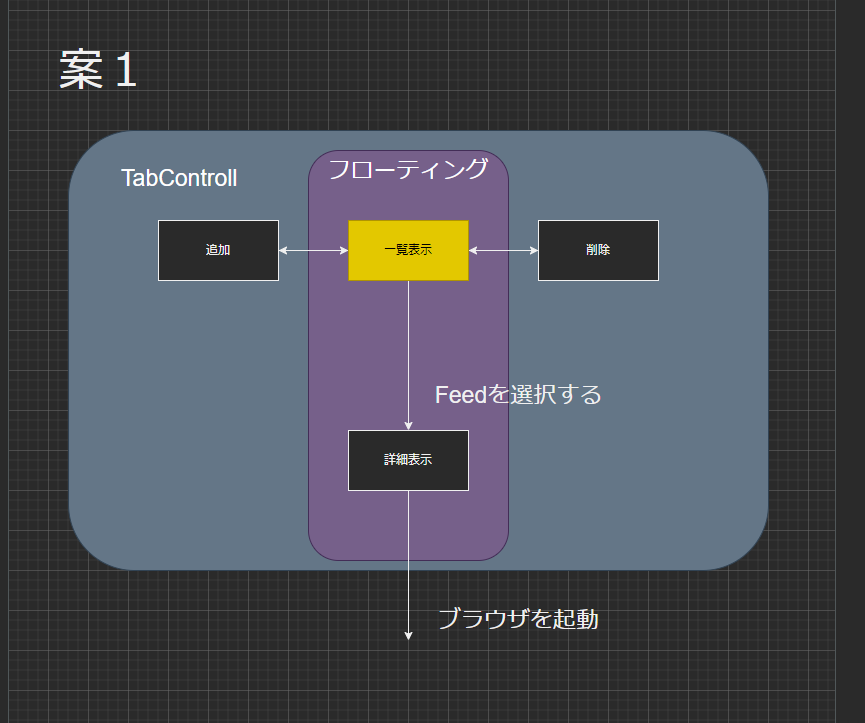

# 総合演習メモ

## 作業メモ

- RSS2用のExtractorの作成ができた。（DefiantLibra）

## 要件（7/8更新）

- 案1
  - 各種RSSフィードから自動的にフィードを収集し、様々な方法でユーザに更新を通知、表示する機能を持つ、GUIアプリケーション

## 基本定義

### 画面遷移

### 画面一覧

- 一覧表示画面
- 追加画面
- 削除画面
- 詳細表示画面

### 機能一覧

- Feed取得機能
- Feed保存機能
- Feed出力機能

### 業務フロー

### 
